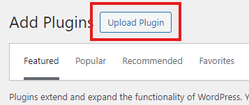
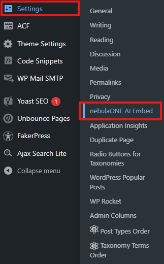
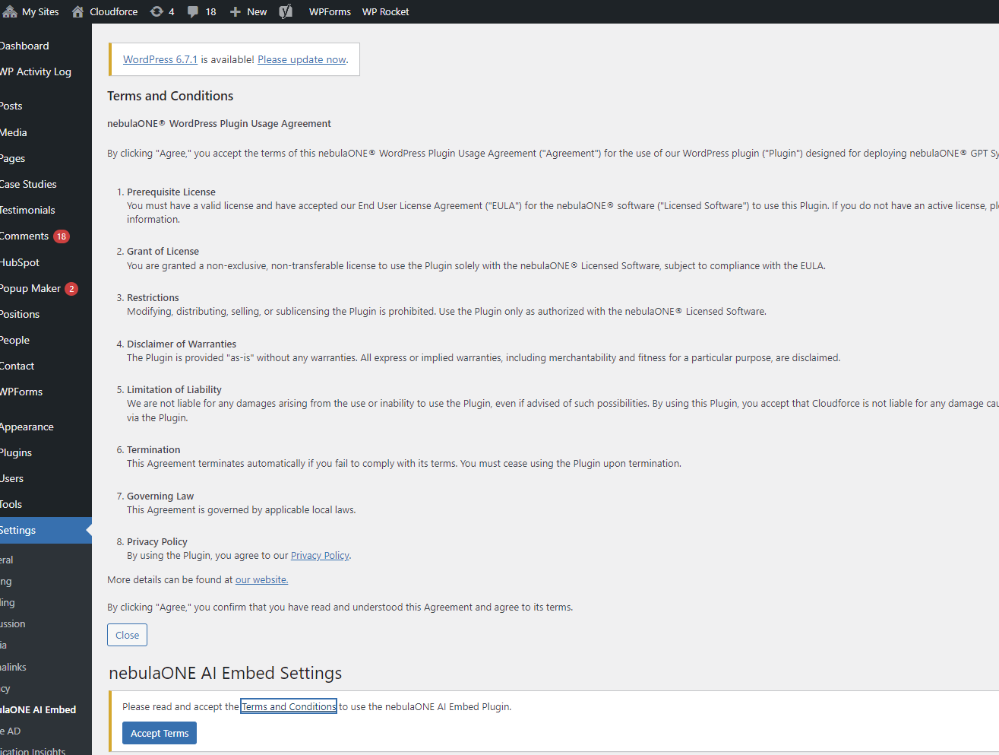
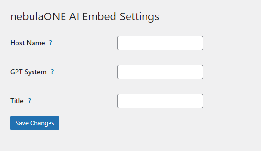
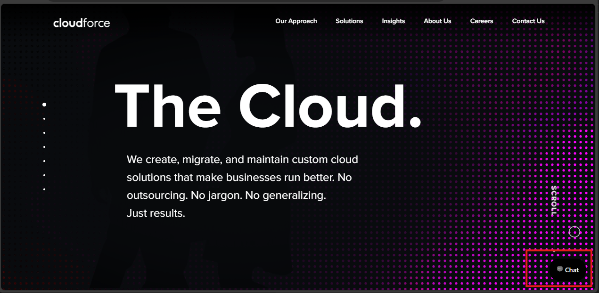

<h1 align="center"><strong>WordPress plugin for nebulaONE®</strong></h1>

This plugin automates the process of embedding a nebulaONE® agent within your WordPress webpage.

Installation

1. Download the `nebulaONE.zip` file located in the `./build` folder.
2. Log in into your `wp-admin` console, navigate to plugins, and then select **Upload Plugin**.

    

3. Once the plugin is installed, navigate to Settings -> nebulaONE® Embed.

    

4. Please read and accept the Terms and Conditions.

    

5. Add the configuration of your nebulaONE® Agent.

    

6. Navigate to your WordPress website. You will see a new nebulaONE® chat icon in the bottom right.

    

## Development

Please follow the general guidelines for WordPress plugin creation available in the [WordPress documentation](https://developer.WordPress.org/block-editor/getting-started/devenv/get-started-with-wp-env/) before making changes to this plugin.

## Available `make` targets

| Command      | Action                |
| :----------- | :-------------------- |
| `make help`  | Display the help menu |
| `make start` | Default Start Target  |
| `make stop`  | Default Stop Target   |
| `make reset` | Default Reset Target  |
| `make build` | Default Build Target  |
| `make clean` | Default Clean Target  |
